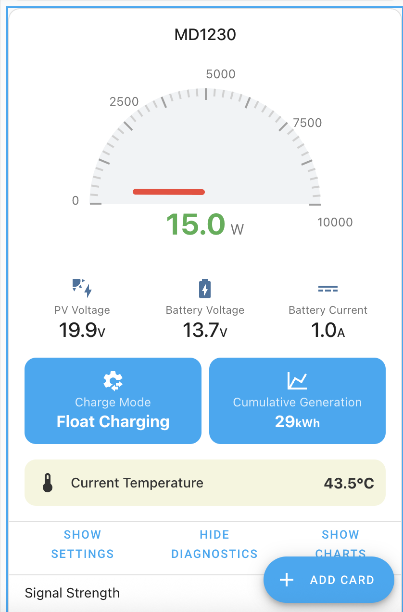

# MakeSkyBlue MPPT Card

A feature-rich Lovelace card for Home Assistant, designed to display and control MakeSkyBlue MPPT solar controllers integrated via the [Solar_Manager](https://github.com/maybetaken/Solar_Manager) custom component.

This card provides a beautiful and comprehensive interface, closely resembling the native mobile app experience, with full localization support for English and Chinese.



## Features

-   **Dynamic Gauge**: A beautiful semi-circular gauge to visualize real-time charging power.
-   **Complete Data Display**: Clearly shows essential data like PV voltage, battery voltage, and battery current.
-   **Informative Panels**: At-a-glance info boxes for the current charging mode and cumulative power generation.
-   **Full Localization**: Automatically switches between English and Chinese based on your Home Assistant user profile settings. All labels and states are translated.
-   **Collapsible Sections**: Keep your dashboard clean with expandable panels for Settings, Diagnostics, and historical Charts.
-   **Full Control**: The **Settings Panel** allows you to adjust all configurable parameters of your MPPT controller, such as equalization voltage, battery type, etc.
-   **Device Diagnostics**: The **Diagnostics Panel** provides tools to check device status (WiFi signal, SSID), toggle the LED, and trigger device restart or reset.
-   **Historical Charts**: The **Charts Panel** displays 24-hour history graphs for power and voltage, allowing you to analyze performance over time.
-   **Simple Configuration**: Just provide your device's unique serial number, and the card will automatically find all related entities.

## Installation

The recommended way to install this card is through the [Home Assistant Community Store (HACS)](https://hacs.xyz/).

1.  Go to HACS > Frontend.
2.  Click the three dots in the top right corner and select **"Custom repositories"**.
3.  Add the URL of this repository (`https://github.com/maybetaken/ha-makeskyblue-mppt-card`) and select the **"Lovelace"** category.
4.  The "MakeSkyBlue MPPT Card" will now appear in your HACS list. Click on it and then click **"Download"**.
5.  Follow the on-screen instructions to add the resource to your Lovelace dashboards.

## Configuration

Add a "Manual" card to your Lovelace dashboard and use the following configuration:

```yaml
type: custom:ha-makeskyblue-mppt-card
device: m7g6fmpw3                 # Required: The unique serial number of your device.
name:  m7g6fmpw3        # Optional: A custom title for the card.
image: /local/makeskyblue-logo.png # Optional: URL for a brand logo to display at the top.
power_switch_entity: switch.your_mppt_power_switch # Optional: Your device's power switch entity ID.
battery_soc_entity: sensor.your_battery_soc_sensor # Optional: Your battery state of charge (SoC) entity ID.
```

### Configuration Variables

| Name                  | Type   | Required | Description                                                                                                                              |
| --------------------- | ------ | -------- | ---------------------------------------------------------------------------------------------------------------------------------------- |
| `type`                | string | Yes      | Must be `custom:ha-makeskyblue-mppt-card`.                                                                                               |
| `device`              | string | Yes      | The unique serial number part of your entity IDs. For example, if your entity is `sensor.makeskyblue_mppt_m7g6fmpw3_pv_voltage`, this should be `m7g6fmpw3`. The card will handle case-insensitivity. |
| `name`                | string | No       | A custom name for the card. If not provided, the serial number will be used.                                                             |
| `image`               | string | No       | A URL to a brand logo image. For local files, place the image in your `/config/www/` directory and use the path `/local/your_image.png`.   |
| `power_switch_entity` | string | No       | If you have a separate `switch` entity to turn the device on/off, provide its full entity ID here.                                        |
| `battery_soc_entity`  | string | No       | If you have a separate `sensor` entity for the battery's state of charge (SoC) percentage, provide its full entity ID here.               |

## Acknowledgements

-   This card is designed to work with the [Solar_Manager](https://github.com/maybetaken/Solar_Manager) custom component.
-   The development process was greatly assisted by the robust Home Assistant developer community.